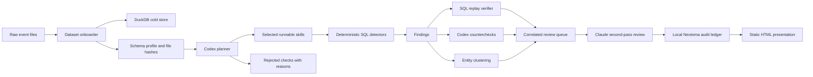
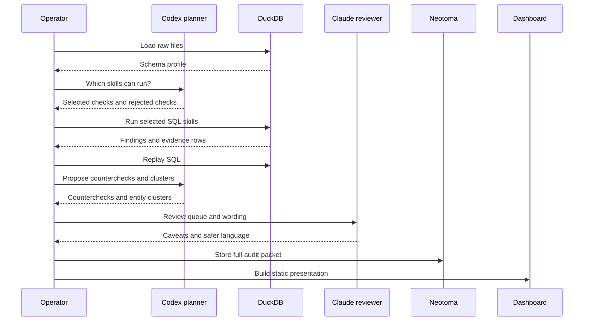
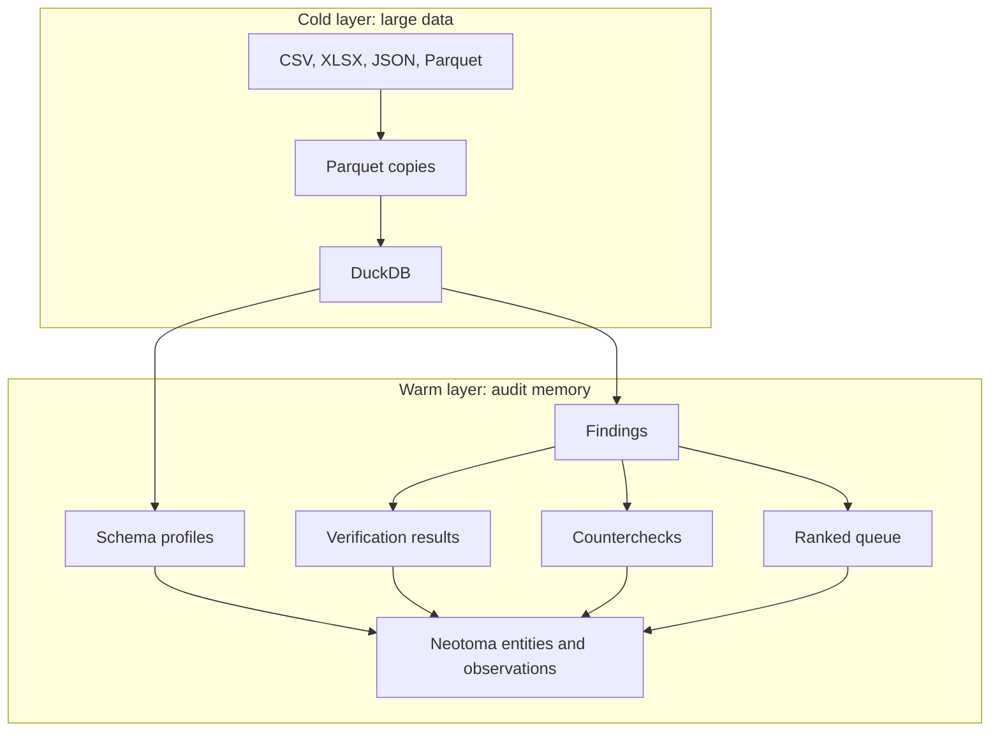

# LemonClaw

**An accountability story engine for public-sector data.** Built for the Agency 2026 Ottawa hackathon, designed to outlive it.

LemonClaw turns unknown government datasets into a short list of stories worth telling, with evidence and caveats attached to each one. Some stories are risks worth reviewing. Some are opportunities worth scaling. Some are operating insights that change how a system is understood. Every story has a source hash, a SQL trail, a counter-check, and a next action.

The pitch is not "catch bad actors." The pitch is: *can we turn public data into clear, defensible stories that help leaders act?* Risk stories matter. So do success stories, capacity stories, policy-gap stories, and opportunity stories. The job is to surface them all, classify them honestly, and refuse the ones the data does not support.

## What It Is, In One Paragraph

A local-first Python workbench. The agent profiles unknown data, decides which of fifteen story-detector skills the data can support, runs the supported ones deterministically against DuckDB, replays every SQL query for reproducibility, runs counter-checks designed to weaken its own findings, clusters likely-same entities, classifies each finding into one of six story types, and writes the whole packet into a local Neotoma ledger. The result is a static HTML dashboard with three columns: risks, operating insight, opportunities. The presentation runs deterministically with no live model calls, so venue Wi-Fi cannot break it.

## Creator Note

This repo is free. Use it, fork it, break it, adapt it. Drop your municipality's contracts data into `data/raw/`, run `make demo`, get a review queue you can take to a council meeting on Monday.

It was built quickly because the foundation already existed. [Neotoma](https://neotoma.io), built by Mark, is the local truth ledger for entities, observations, sources, and replayable audit memory. [Lemonbrand](https://lemonbrand.io) is the studio for building practical agentic systems: local-first workflows, data products, internal tools, and automation that help teams move fast without losing the evidence trail.

The point of publishing this is not to sell hackathon code. The point is to make the pattern visible: models are useful when they plan, classify, and challenge. Databases and ledgers should hold the truth.

## Plain English

A human reviewer usually starts with messy files and asks:

1. What data did we receive?
2. Which questions can this data actually answer?
3. Which questions are impossible because the fields are missing?
4. What stories are worth telling first?
5. What would weaken or disprove each story?
6. Can another person replay the work later?

LemonClaw turns that into a repeatable loop.

It loads raw files into DuckDB, profiles the schemas, asks a model to choose only the skills the data can support, runs those skills with SQL, verifies the SQL can replay, runs counter-checks, clusters likely-same names, asks a story-shaping model to classify each finding into a story type with seven fields, and stores the whole packet in a local Neotoma ledger.

The output is not a black-box model answer. It is a short list of stories with source hashes, SQL, verification status, counter-checks, and human-safe wording. The story types are: **risk**, **opportunity**, **capacity**, **policy gap**, **success**, **operating insight**.

## Story Types

| Type | When LemonClaw uses it |
| --- | --- |
| Risk | A pattern the data suggests warrants pulling a file or auditing a relationship. |
| Opportunity | An underused program or under-resourced delivery footprint that could be scaled. |
| Capacity | An organization with funding-to-delivery imbalance that needs operational support. |
| Policy gap | Spending and stated commitments are not moving together. |
| Success | A program quietly working: stable funding, diverse delivery, geographic reach. |
| Operating insight | A finding that changes how a system is understood without being a flag. |

## What It Produces

- A schema profile of every loaded dataset.
- A visible plan showing selected and rejected story-detector skills, each with reasons.
- Deterministic findings from runnable skills, every finding tagged with a story type and lens.
- Replayable SQL for every finding.
- Disconfirming checks that try to weaken each finding.
- Entity clustering before correlation.
- A seven-field story packet per finding (what happened, why it matters, who is affected, evidence, what could disprove, what to check next, decision enabled).
- A local Neotoma audit packet.
- A static HTML dashboard at `web/dashboard.html`, organized into three columns: risks, operating insight, opportunities.

## System Map



## Agentic Loop

The agentic part is not "let the model invent conclusions."

The agentic part is:

- look at an unknown schema
- choose what checks are possible
- reject checks that are not supported by the data
- propose counterchecks
- group likely related entities cautiously
- challenge the final language

The calculations are still deterministic. DuckDB runs the SQL. Neotoma records the trail.



## Data Architecture



Large files stay in DuckDB. Neotoma only stores what matters for audit: profiles, plans, findings, evidence references, verification results, counterchecks, review language, and the final queue.

## Implemented Skills

| Skill | Story type | What it surfaces | Source | Status |
| --- | --- | --- | --- | --- |
| Vendor concentration | Risk | One vendor dominating spend in a category | Local CSV / hackathon | Implemented |
| Amendment creep | Risk | Contracts whose value grew materially after award (local files) | Local CSV | Implemented |
| Related parties | Operating insight | Names appearing across organizations | Local CSV | Implemented |
| **Tri-jurisdictional funding** | Policy gap | Organizations funded by all three Canadian jurisdictions | Hackathon `general.entity_golden_records` | Implemented |
| **CRA loop risk** | Risk | High circular-gifting score on T3010 qualified-donee gifts | Hackathon `cra.loop_universe` | Implemented |
| **AB sole-source concentration** | Risk | Vendor dominance inside Alberta sole-source contracts by ministry | Hackathon `ab.ab_sole_source` | Implemented |
| **FED amendment creep** | Risk | Federal agreements whose current value materially exceeds the original (F-3-safe) | Hackathon `fed.grants_contributions` | Implemented |
| **CRA shared directors** | Operating insight | Director names appearing on the boards of 3+ distinct charities | Hackathon `cra.cra_directors` | Implemented |

Twelve more skills are declared in the registry as stubs, balanced across story types: zombie-recipients, ghost-capacity, funding-loops, policy-misalignment, duplicative-funding, contract-intelligence, adverse-media, **geographic-coverage**, **program-stability**, **delivery-diversity**, **scale-readiness**, **commitment-alignment**.

A stub can only be selected by the planner when both conditions are true:

1. The provided data has the required fields (declared in `config/skills.json`).
2. The detector function exists and the skill's `command` is set.

Stubs are surfaced as rejections with reasons. That is intentional. "We cannot support this story from this dataset" is part of the product. Implementing a stub is a small, well-scoped contribution: ship a detector function, set the `command` field, send a PR.

## Hackathon Data Quality Notes

LemonClaw's federal amendment-creep skill implements the [F-3 mitigation](https://github.com/GovAlta/agency-26-hackathon/blob/main/KNOWN-DATA-ISSUES.md) from the GovAlta `KNOWN-DATA-ISSUES.md`: it deduplicates per `(ref_number, recipient_key)` before comparing original to current value. Naive `SUM(agreement_value)` on `fed.grants_contributions` inflates by ~$388B (~73%) because every amendment row restates the running total.

The CRA loop-risk skill wraps the pre-computed `cra.loop_universe` score (0-30) rather than rebuilding cycle detection. CRA's pipeline already cross-validates self-join against Johnson's algorithm; LemonClaw's value is to package the high-score charities with seven-field story packets and a next action.

The tri-jurisdictional skill leans on `general.entity_golden_records` from the GovAlta entity-resolution pipeline (deterministic + Splink + LLM-authored). Findings emitted by `tri-jurisdictional-funding` carry the canonical name straight from the golden record. LemonClaw's separate entity-resolution module still runs the heuristic / Codex clustering on surfaced findings; folding golden-record IDs in as the primary cluster key is a tomorrow-morning improvement.

## Demo Workflow

### Option A — Hackathon dataset (real Canadian government data)

Wires LemonClaw to the GovAlta Agency 2026 Postgres replica (CRA T3010 ~8.8M rows + federal grants ~1.3M + Alberta ~2.6M + golden records ~851K). Materializes a working subset locally, then runs the full LemonClaw pipeline against it.

```bash
./scripts/bootstrap.sh           # one-time: venv + Neotoma
make hackathon                   # ~30s materialize + ~15s skills + dashboard
open web/dashboard.html
```

`make hackathon` runs:
- `hackathon-onboard` — ATTACH Postgres via DuckDB's `postgres` extension, materialize six `hk_*` working tables (~3M rows total in ~30s).
- `plan` — heuristic planner selects the implemented skills the data supports, rejects the rest with reasons.
- `run-plan` — six skills execute against the materialized tables: `tri-jurisdictional-funding`, `cra-loop-risk`, `ab-sole-source-concentration`, `fed-amendment-creep`, `cra-shared-directors`, `vendor-concentration`.
- `verify` → `disconfirm` → `resolve-entities` → `correlate` → `review` → `promote` → `ui` (same downstream pipeline as the demo path).

For the full model-assisted hackathon run (Codex planner, Claude story-shaper):

```bash
make hackathon-agentic
```

### Option B — Local demo data (offline development)

Runs the same pipeline against the small CSV fixtures in `data/raw/` so contributors can develop without Postgres access.

```bash
./scripts/bootstrap.sh
make demo                        # heuristic planner + heuristic reviewer
make demo-agentic                # Codex planner + Claude reviewer
open web/dashboard.html
```

The presentation path runs deterministically with no live model calls so venue Wi-Fi cannot break it. Codex / Claude run in the prep step (`make hackathon-agentic` or `make demo-agentic`) and their output is cached in `state/review.json` for the dashboard to read.

## Commands

```bash
./bin/lemonclaw onboard
./bin/lemonclaw plan --brain codex
./bin/lemonclaw run-plan
./bin/lemonclaw verify
./bin/lemonclaw disconfirm --brain codex
./bin/lemonclaw resolve-entities --brain codex
./bin/lemonclaw correlate
./bin/lemonclaw review --reviewer claude
./bin/lemonclaw promote
./bin/lemonclaw ui
```

`bin/lemonclaw` and `bin/agency` are equivalent entry points. The package import path stays `agency_claw` for now; the binary is what users see.

The deterministic fallback swaps `codex` and `claude` for `heuristic`:

```bash
make demo
```

## Local Neotoma

This repo runs its own local Neotoma instance and data directory.

- Runtime: `.runtime/neotoma/`
- Data: `.neotoma/data/`
- Tenant: `agency-2026-local`

Use the wrapper so the repo does not depend on any global Neotoma tunnel:

```bash
./scripts/neotoma.sh entities list --type finding --user-id agency-2026-local
```

## What Counts As Truth

No finding is trusted because a model wrote it.

A finding is reviewable when it has:

- source file hash
- table profile
- replayable SQL
- evidence rows or aggregate metrics
- SQL replay status
- countercheck status
- reviewer language
- Neotoma observation record

The model proposes. DuckDB checks. Neotoma remembers. The HTML makes it readable.

## Repository Layout

```text
agency_claw/          Python package for onboard, plan, run, verify, review, and dashboard
bin/                  CLI wrappers for agency, Codex, Claude, and nono
config/skills.json    Skill registry and applicability declarations
data/raw/             Original event files, ignored by git
data/parquet/         Generated query layer, ignored by git
data/findings/        Generated findings, ignored by git
docs/                 Public explainers and diagrams
state/                Generated schema profiles and run state, ignored by git
web/dashboard.html    Generated static demo dashboard, ignored by git
```

## Read More

- [Plain English Explainer](docs/plain-english.md)
- [Architecture](docs/architecture.md)
- [Presentation Demo Plan](docs/presentation-demo.md)
- [Actionable State](docs/actionable-state.md)
- [Public Repo Notes](docs/public-repo.md)
