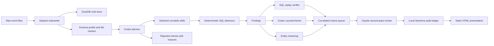
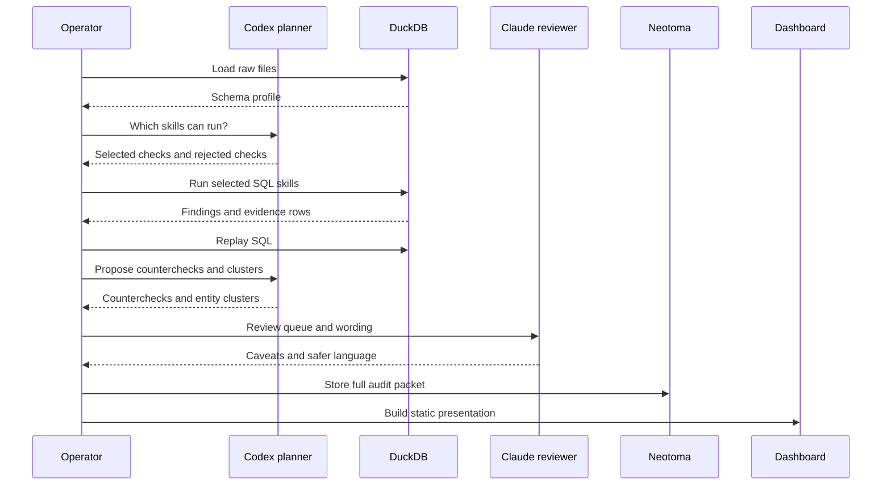
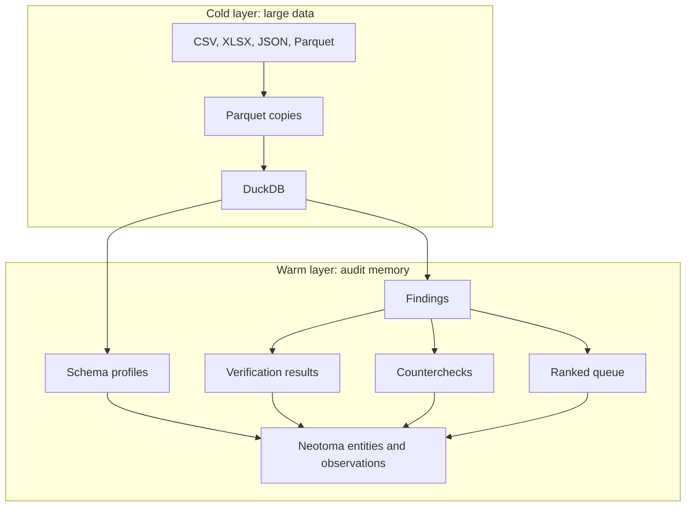

# Agency 2026 Claw

Local-first accountability workbench for turning large public-sector datasets into reviewable, replayable leads.

This was built for the Agency 2026 Ottawa hackathon. The goal is not to accuse anyone. The goal is to show how an agentic audit loop can inspect unknown datasets, decide which checks are valid, run those checks deterministically, and produce a clear action queue with an audit trail.

The presentation is a traditional HTML demo. The work runs before the presentation. The judges see the resulting dashboard, the evidence trail, the rejected checks, and the next actions.

## Plain English

A human reviewer usually starts with messy files and asks:

1. What data did we receive?
2. Which accountability questions can this data actually answer?
3. Which questions are impossible because the fields are missing?
4. What leads are worth reviewing first?
5. What would weaken or disprove each lead?
6. Can another person replay the work later?

Agency 2026 Claw turns that into a repeatable loop.

It loads raw files into DuckDB, profiles the schemas, asks a model to choose only the checks that the data can support, runs those checks with SQL, verifies the SQL can replay, runs counterchecks, clusters likely related names, asks a second model to challenge the language, and stores the whole packet in a local Neotoma ledger.

The output is not a black-box model answer. It is a short list of review leads with source hashes, SQL, verification status, counterchecks, and human-safe wording.

## What It Produces

- A schema profile of every loaded dataset.
- A visible plan showing selected and rejected checks.
- Deterministic findings from runnable skills.
- Replayable SQL for every finding.
- Disconfirming checks that try to weaken the finding.
- Entity clustering before correlation.
- A ranked action queue.
- A local Neotoma audit packet.
- A static HTML dashboard at `web/dashboard.html`.

## System Map



## Agentic Loop

The agentic part is not "let the model invent conclusions."

The agentic part is:

- look at an unknown schema
- choose what checks are possible
- reject checks that are not supported by the data
- propose counterchecks
- group likely related entities cautiously
- challenge the final language

The calculations are still deterministic. DuckDB runs the SQL. Neotoma records the trail.



## Data Architecture



Large files stay in DuckDB. Neotoma only stores what matters for audit: profiles, plans, findings, evidence references, verification results, counterchecks, review language, and the final queue.

## Implemented Skills

| Skill | What it checks | Status |
| --- | --- | --- |
| Vendor concentration | Whether one vendor dominates spend in a category | Implemented |
| Amendment creep | Whether contract values grew materially after award | Implemented |
| Related parties | Whether names appear across organizations and datasets | Implemented as review leads |

The rest of the Agency 2026 challenge set is represented in the skill registry as stubs. They can be selected only when both conditions are true:

1. The provided data has the required fields.
2. The detector has an implemented command.

Unsupported checks are shown as rejections. That is intentional. "We cannot support this claim from this dataset" is part of the audit product.

## Demo Workflow

Use this for the public HTML presentation:

```bash
./scripts/bootstrap.sh
make presentation
open web/dashboard.html
```

`make presentation` runs the local deterministic demo path and rebuilds the HTML dashboard. It does not require a live model call during the presentation.

For the full model-assisted preparation path:

```bash
./scripts/bootstrap.sh
./scripts/create-demo-data.py
make demo-agentic
open web/dashboard.html
```

`make demo-agentic` uses:

- Codex CLI for schema-to-skill planning, counterchecks, and entity clustering.
- Claude CLI for skeptical second-pass review.
- DuckDB for deterministic execution.
- Local Neotoma for audit storage.

## Commands

```bash
./bin/agency onboard
./bin/agency plan --brain codex
./bin/agency run-plan
./bin/agency verify
./bin/agency disconfirm --brain codex
./bin/agency resolve-entities --brain codex
./bin/agency correlate
./bin/agency review --reviewer claude
./bin/agency promote
./bin/agency ui
```

The deterministic fallback swaps `codex` and `claude` for `heuristic`:

```bash
make demo
```

## Local Neotoma

This repo runs its own local Neotoma instance and data directory.

- Runtime: `.runtime/neotoma/`
- Data: `.neotoma/data/`
- Tenant: `agency-2026-local`

Use the wrapper so the repo does not depend on any global Neotoma tunnel:

```bash
./scripts/neotoma.sh entities list --type finding --user-id agency-2026-local
```

## What Counts As Truth

No finding is trusted because a model wrote it.

A finding is reviewable when it has:

- source file hash
- table profile
- replayable SQL
- evidence rows or aggregate metrics
- SQL replay status
- countercheck status
- reviewer language
- Neotoma observation record

The model proposes. DuckDB checks. Neotoma remembers. The HTML makes it readable.

## Repository Layout

```text
agency_claw/          Python package for onboard, plan, run, verify, review, and dashboard
bin/                  CLI wrappers for agency, Codex, Claude, and nono
config/skills.json    Skill registry and applicability declarations
data/raw/             Original event files, ignored by git
data/parquet/         Generated query layer, ignored by git
data/findings/        Generated findings, ignored by git
docs/                 Public explainers and diagrams
state/                Generated schema profiles and run state, ignored by git
web/dashboard.html    Generated static demo dashboard, ignored by git
```

## Read More

- [Plain English Explainer](docs/plain-english.md)
- [Architecture](docs/architecture.md)
- [Presentation Demo Plan](docs/presentation-demo.md)
- [Actionable State](docs/actionable-state.md)
- [Public Repo Notes](docs/public-repo.md)
