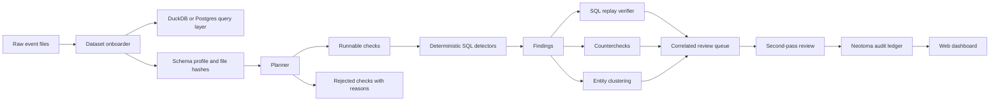
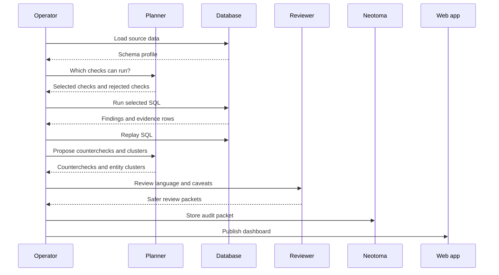
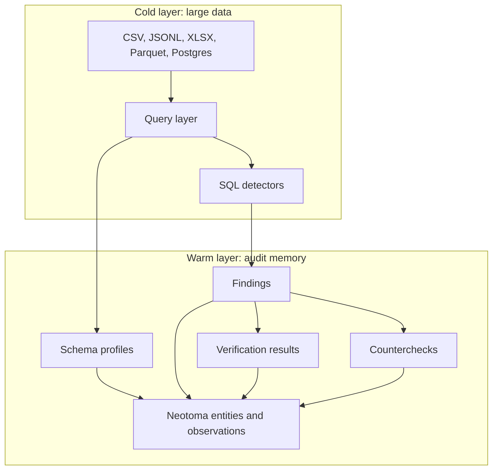

# LemonClaw

An accountability workbench for public-sector data. Built at Agency 2026 Ottawa to turn large government datasets into review leads with receipts.

Live demo: [agency2026.lemonbrand.io](https://agency2026.lemonbrand.io/)

LemonClaw does not claim fraud. It finds patterns worth reviewing, names what source data supports them, and refuses claims the data cannot prove.

## What It Does

LemonClaw takes messy government datasets and turns them into:

- a schema profile of the data received
- a plan showing which accountability checks can run
- a rejection list for checks the data cannot support
- deterministic SQL findings
- replayable query hashes
- counterchecks that could weaken each finding
- plain-English review packets
- a web dashboard for judges, reviewers, and policy staff

The model helps plan, classify, cluster, and write safer language. The database does the calculations. The ledger keeps the audit trail.

## Why It Exists

Public-sector accountability work is usually limited by time, not imagination. A human can inspect one spreadsheet, one program, or one vendor relationship. The hard part is holding several tables, several years, and several jurisdictions in mind at once.

LemonClaw makes that work repeatable. It gives a reviewer a short queue of leads and the receipts needed to decide what deserves human follow-up.

## Creator Note

This repo is free to use and fork.

It was built quickly because the foundation already existed. [Neotoma](https://neotoma.io), by Mark, is the truth ledger for entities, observations, sources, and replayable audit memory. [Lemonbrand](https://lemonbrand.io) builds practical agentic systems: local-first workflows, data products, internal tools, and automation that move fast without losing the evidence trail.

The pattern matters more than the hackathon code: models are useful when they plan, challenge, and explain. Databases and ledgers should hold the truth.

## System Map



## Agentic Loop

The agentic part is not inventing conclusions. The agentic part is deciding what can be checked, refusing what cannot, and challenging the wording before a human sees it.



## Data Architecture

Large data stays in the query layer. Neotoma stores the evidence trail, not millions of raw rows.



## Current Coverage

Implemented checks include:

| Check | What it surfaces | Proof state |
| --- | --- | --- |
| Vendor concentration | Ministries or categories dominated by a small vendor set | SQL-backed |
| Sole-source concentration | Alberta sole-source vendor dependence by ministry | SQL-backed |
| Federal amendment creep | Agreements where current value materially exceeds original value | SQL-backed with GovAlta F-3 mitigation |
| CRA loop risk | High circular-gifting scores from CRA loop data | SQL-backed |
| Shared directors | Director names appearing across multiple charities | SQL-backed |
| Tri-jurisdictional funding | Entities present across CRA, federal, and Alberta records | SQL-backed |

Other Agency 2026 challenges are declared as checks and can be refused with reasons when required fields or external sources are missing. Refusal is a feature, not a gap hidden from the viewer.

## Run It

```bash
./scripts/bootstrap.sh
make demo
open web/dashboard.html
```

For the Agency 2026 dataset:

```bash
make hackathon
```

For the web app:

```bash
cd site
npm install
npm run build
npm run preview
```

The public deployment runs `site/server.js` behind nginx with runtime environment values stored server-side. See [DEPLOYMENT.md](DEPLOYMENT.md).

## What Counts As Truth

A review lead is credible when it has:

- source table or file reference
- replayable SQL
- query hash
- evidence rows or aggregate metrics
- countercheck
- proof level
- human-safe language

The model proposes. SQL checks. Neotoma remembers. The app makes the result readable.

## Repository Layout

```text
agency_claw/       Backend pipeline and public export code
config/            Skill declarations and check metadata
data/              Local generated data, ignored by git
docs/              Supporting explainers
scripts/           Build, refresh, and export helpers
site/              Public web app
sovereignty-tracker/ Token and cost tracking
```

## Read More

- [Deployment](DEPLOYMENT.md)
- [Plain English Explainer](docs/plain-english.md)
- [Architecture](docs/architecture.md)
- [Actionable State](docs/actionable-state.md)
