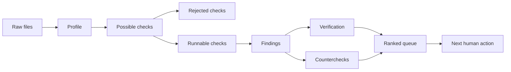

# From Raw Data To Actionable State

The core product is not a chart.

The core product is an actionable state:

- what to review
- why it matters
- what evidence supports it
- what evidence weakens it
- what to do next

## Raw State

Raw state is a folder of files.

The reviewer does not yet know:

- which columns exist
- which rows are reliable
- which questions can be answered
- which checks would be irresponsible
- which entities matter

Raw state creates effort.

## Actionable State

Actionable state is a ranked queue.

Each queue item answers:

- who or what is the review lead?
- which independent signals point at it?
- what is the next human action?
- what SQL produced the signal?
- did the SQL replay?
- what countercheck was run?
- is the lead supported, contested, or not checked?
- what language is safe to use?

Actionable state creates motion.

## Transformation



## Example Lead Shape

```json
{
  "entity": "Civic Build Co",
  "status": "validate",
  "signals": [
    "vendor concentration",
    "amendment creep"
  ],
  "next_action": "Pull contract file, amendment approvals, procurement method, and competing bids.",
  "support": {
    "supported": 1,
    "contested": 1
  }
}
```

That is the point of the system. It turns "interesting pattern" into "specific reviewer action."

## Why Rejections Matter

Rejections are part of the answer.

If a dataset has no dissolution date, the system should not run a zombie-recipient check. If a dataset has no transfer fields, it should not claim funding loops. If adverse media requires external sources and the demo path is offline, it should not pretend to have run public-record validation.

Visible rejection is what separates an audit loop from a dashboard that overclaims.

## Final State

The final state is a package:

- `state/investigation-plan.json`
- `data/findings/verified.json`
- `data/findings/disconfirming-checks.json`
- `data/findings/correlated.json`
- `state/review.json`
- local Neotoma observations
- `web/dashboard.html`

The HTML is the presentation. The JSON and Neotoma records are the audit trail.
