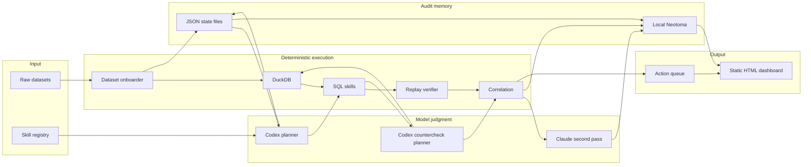
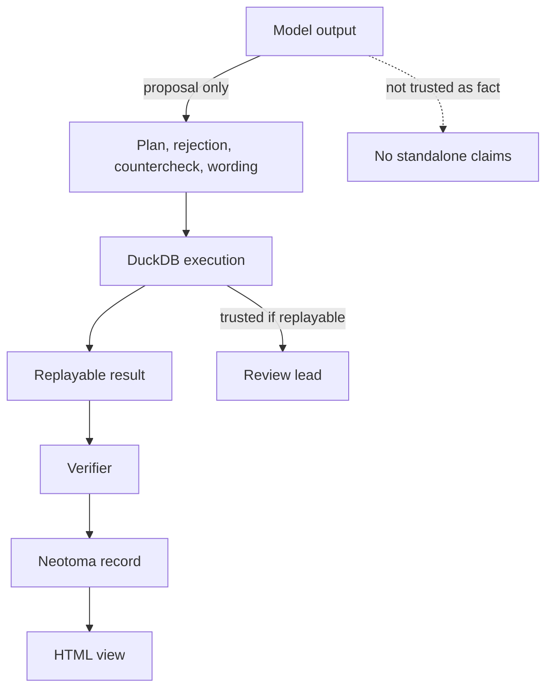
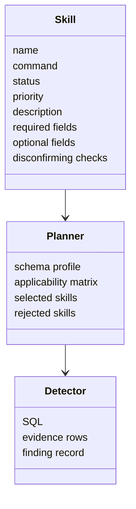
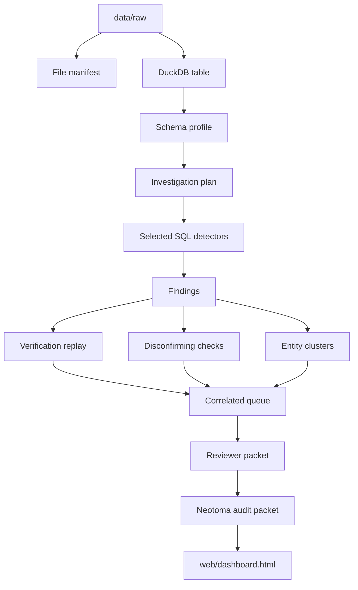

# Architecture

LemonClaw separates speed from truth.

DuckDB is the speed layer. It handles raw files and large joins locally.

Neotoma is the truth layer. It stores the small set of decisions, findings, checks, and review records that need to survive the run.

Codex and Claude sit around the deterministic layer. They help select and challenge the work. They do not replace the replayable work.

## Component Graph

## Trust Boundaries

Models can propose:

- run this skill
- reject that skill
- try this countercheck
- use safer wording

Models cannot create final truth by themselves.

## Skill Registry

Each skill declares what it needs before it can run.

This is why rejection is visible. If the data has no dissolution date, the zombie-recipient check is rejected. If there is no transfer graph, funding-loop analysis is rejected. That is not a failure. That is audit discipline.

## Data Flow

## Why Local-First

The demo path is laptop-local because the event environment is unpredictable.

Local-first means:

- no VPS dependency
- no remote database dependency
- no venue Wi-Fi dependency for the HTML presentation
- raw event files do not need to leave the laptop
- the audit packet can be pushed later if appropriate

The model-assisted preparation path can use Codex and Claude through local subscription CLIs. The presentation does not require those calls to be live.
