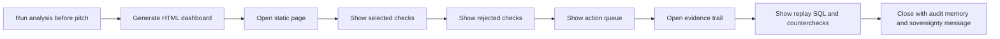

# Presentation Demo Plan

The presentation is a traditional HTML demo.

We run the analysis first. We present the generated dashboard. We do not make the judges wait for live model calls.

## Why

Live agent demos are fragile:

- model latency varies
- venue Wi-Fi can fail
- auth prompts can interrupt the flow
- one bad output can derail a short pitch

This project is about auditable truth, not theater. The right demo is a stable dashboard backed by a replayable packet.

## Demo Build Command

For a deterministic local demo:

```bash
make presentation
open web/dashboard.html
```

For the full model-assisted preparation run:

```bash
./scripts/bootstrap.sh
./scripts/create-demo-data.py
make demo-agentic
open web/dashboard.html
```

The generated file is ignored by git:

```text
web/dashboard.html
```

That is intentional. The repo contains the system. The dashboard is a generated artifact.

## Presentation Flow



## What To Show First

Start with the decision block:

- which leads are worth reviewing first
- which ones are contested
- what the next human action is

Do not start with architecture. Architecture explains why the output can be trusted. The output is the story.

## What To Say

Plain version:

> We loaded the files, asked the system what checks the data could actually support, rejected the checks it could not support, ran the valid checks with SQL, replayed the SQL, ran counterchecks, and produced this review queue. The system does not say fraud. It says what a human reviewer should validate next.

Short version:

> The agent decides what work is valid. DuckDB does the math. Neotoma records the audit trail. The dashboard turns it into action.

## What Not To Claim

Do not say:

- fraud found
- corruption found
- illegal activity found
- confirmed related party
- confirmed wrongdoing

Use:

- review lead
- candidate
- name-overlap candidate
- contested
- supported by loaded data
- needs identity validation
- needs contract-file review

## Backup Plan

If the model-assisted run is slow, use:

```bash
make presentation
```

The deterministic path proves the system works without live models. The public point remains the same: the system produces an auditable action queue, not a chatbot answer.
